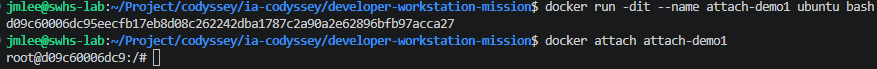
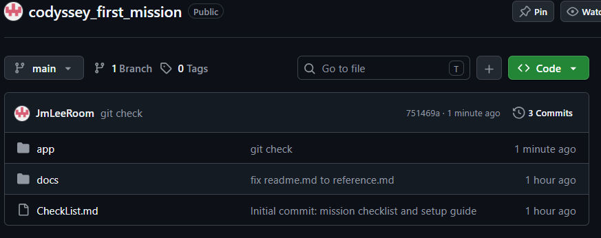

# 개발자 워크스테이션 구축 — Linux CLI / Docker / Git·GitHub

> 코드잇 부트캠프 "내 컴퓨터에 개발자용 '작업실' 꾸미기" 미션 제출용 기술 문서.
> 진행 체크리스트는 [`CheckList.md`](./CheckList.md), 미션 원문은 [`docs/reference.md`](./docs/reference.md), 각 항목의 세부 로그·관찰 메모는 [`docs/study/`](./docs/study/) 참고.
>
> 🎓 **인터랙티브 학습 교안**: [`docs/learn/index.html`](./docs/learn/index.html) — 이 프로젝트의 내용을 15개 모듈로 재구성한 학습 콘솔입니다. 터미널 시뮬레이터·chmod 계산기·포트 충돌 재현기 등 직접 조작하는 실습과 38문항의 확인 문제, 종합 시험이 포함되어 있습니다. 브라우저로 파일을 열면 바로 실행됩니다(설치·인터넷 불필요).

## 목차

1. [프로젝트 개요](#1-프로젝트-개요)
2. [실행 환경](#2-실행-환경)
3. [학습 목표 자가 점검](#3-학습-목표-자가-점검)
4. [수행 항목 체크리스트](#4-수행-항목-체크리스트)
5. [상세 수행 내역 및 검증 방법](#5-상세-수행-내역-및-검증-방법)
6. [트러블슈팅](#6-트러블슈팅)
7. [진행 상황 요약 및 남은 과제](#7-진행-상황-요약-및-남은-과제)
8. [참고 문서](#8-참고-문서)

---

## 1. 프로젝트 개요

이 프로젝트는 로컬 컴퓨터에 재현 가능한 개발 환경을 직접 구축하는 것을 목표로 한다. 핵심 도구는 **리눅스 CLI(터미널)**, **Docker(컨테이너)**, **Git/GitHub(버전 관리 및 협업)** 세 가지이며, 다음 흐름으로 진행했다.

1. 터미널로 작업 디렉토리를 구성하고 파일 권한을 다뤘다.
2. Docker를 설치·점검하고, 이미지/컨테이너를 실행·관리하는 기본 운영 명령을 익혔다.
3. 기존 Dockerfile을 기반으로 웹 서버를 컨테이너화하고, 포트 매핑으로 접속을 검증했다.
4. 바인드 마운트와 Docker 볼륨을 각각 사용해 "변경 사항 즉시 반영"과 "컨테이너 삭제 후에도 유지되는 데이터 영속성"을 직접 확인했다.
5. Git 사용자 설정과 GitHub/VSCode 연동을 완료해, 모든 작업 결과를 이 저장소에 커밋·푸시했다.
6. (보너스) Docker Compose로 멀티 컨테이너 구성, 운영 명령 루틴, 환경 변수 주입까지 확인했다.

단순히 명령을 따라 친 것이 아니라, 각 단계의 실행 결과(로그·접속 화면·데이터 유지 여부)로 "이미지와 컨테이너의 분리", "격리된 실행 환경", "포트/스토리지 연결 방식" 같은 구조적 원칙을 직접 검증하고 설명 가능한 형태로 정리하는 것이 목표였다.

## 2. 실행 환경

> 확인 명령: `cat /etc/os-release`, `uname -srm`, `echo $SHELL`, `bash --version`, `docker --version`, `docker compose version`, `git --version` ([`docs/study/docker-install-check.md`](./docs/study/docker-install-check.md) 참고)

| 항목 | 값 |
| --- | --- |
| OS | Ubuntu 24.04.4 LTS (Noble Numbat) |
| Kernel | 6.8.0-136-generic |
| Shell | bash 5.2.21 |
| Docker | 29.6.2 (Docker Engine - Community) |
| Docker Compose | v5.3.1 |
| Git | 2.43.0 |

`sudo` 권한 제약이 없는 네이티브 Linux 환경이라 OrbStack 없이 Docker Engine을 직접 사용했다 (서울캠퍼스 sudo 제약 환경이라면 OrbStack 경로를 대신 사용).

> **개인 환경 종속 경로 안내**: 이 문서와 `docs/study/*.md`의 명령 예시에는 실습 당시 실제 경로(`/home/jmlee/Project/codyssey/codyssey_first_mission`, 사용자명 `jmlee`)가 그대로 남아있다. 다른 환경에서 재현할 때는 이 절대 경로를 본인의 저장소 클론 경로로 바꿔서 실행하면 된다 — 명령 구조 자체는 환경에 관계없이 동일하게 동작한다. 일부 `docs/study/` 문서는 자산을 이 저장소로 옮겨오기 전 참고했던 개인 PC의 다른 작업 폴더(`ia-codyssey/developer-workstation-mission`)를 출처로 언급하는데, 그 폴더는 이 저장소에 포함되어 있지 않다 — 다만 거기서 가져온 실제 파일(`app/` 전체)은 이 저장소 안에 그대로 들어있어 재현에는 지장이 없다.

## 3. 학습 목표 자가 점검

> 전체 설명: [`docs/study/concepts.md`](./docs/study/concepts.md)

**절대 경로 vs 상대 경로** — 절대 경로(`/home/jmlee/.../hello.txt`)는 `/`부터 시작해 어디서 실행하든 항상 같은 파일 하나만 가리킨다. 상대 경로(`hello.txt`, `./hello.txt`, `../../Dockerfile`)는 현재 작업 위치가 기준이라, 실행 위치가 바뀌면 가리키는 대상도 달라진다. 절대 경로는 GPS 좌표처럼 위치가 불변이고, 상대 경로는 "여기서 두 블록 앞"처럼 내가 서 있는 곳이 기준이다.

**파일 권한(r/w/x)과 755·644** — 권한 문자열은 소유자/그룹/기타 3자리씩 10칸으로 읽는다. r=4, w=2, x=1을 더해 숫자 표기를 만든다 (755=`rwxr-xr-x`, 644=`rw-r--r--`). 파일의 `x`는 "실행 가능", 디렉터리의 `x`는 "그 안으로 `cd`해서 통과 가능"이라는 뜻이라 의미가 다르다 — 디렉터리를 700으로 바꾸면 `r`이 있어도 `x`가 없는 다른 사용자는 내부를 못 본다.

**Dockerfile 기반 커스텀 이미지 제작 절차** — 베이스 이미지(`nginx:1.30-alpine`)를 고르고, `COPY`로 설정 파일·정적 콘텐츠를 교체하고, `HEALTHCHECK`/`EXPOSE`/`LABEL`로 상태 판정·포트 문서화·메타데이터를 추가하는 방식으로 진행했다. 핵심은 베이스 이미지가 이미 갖춘 기능은 그대로 두고 "무엇을 다르게 할지"만 선언적으로 얹는 것이다.

**포트 매핑이 필요한 이유** — 컨테이너는 호스트와 분리된 자체 네트워크 영역을 가지므로, 컨테이너 안에서 NGINX가 80번을 들어도 호스트 브라우저는 직접 닿을 수 없다. `-p <호스트포트>:<컨테이너포트>`가 그 사이에 통로를 뚫는다. ① 외부 노출, ② 같은 이미지를 여러 호스트 포트로 동시 실행(포트 충돌 회피), ③ 필요한 포트만 선택적으로 열어 나머지는 컨테이너 네트워크 안에 가두는 보안 — 세 가지 이유로 필요하다. 실제로 `web-demo`(8080), `web-demo-2`(8081)를 동시에 띄워 이 성질을 직접 확인했다.

**Docker 볼륨(영속 데이터)** — 컨테이너의 쓰기 레이어는 컨테이너와 함께 사라진다. 이름 있는 볼륨은 Docker가 관리하는 호스트 영역(`/var/lib/docker/volumes/<name>/_data`)에 데이터를 두고 컨테이너 경로에 연결하므로, 컨테이너의 생명 주기와 데이터의 생명 주기가 분리된다. 컨테이너를 삭제한 뒤 새 컨테이너에서 같은 볼륨을 연결해도 데이터와 SHA-256 체크섬이 그대로였다.

**Git과 GitHub의 역할 차이** — Git은 내 컴퓨터(로컬)에서 소스 변경 이력을 기록·관리하는 버전 관리 소프트웨어로 인터넷 없이도 동작한다. GitHub는 그 저장소를 인터넷에 올려 공유·협업하는 웹 플랫폼이다. Git은 개인 연습장, GitHub는 그 내용을 올려 공유하는 블로그에 비유할 수 있다.

## 4. 수행 항목 체크리스트

상세 진행 체크리스트(힌트 포함)는 [`CheckList.md`](./CheckList.md)에서 관리한다. 제출 시점 기준 요약은 아래와 같다.

- [x] 터미널 기초 조작 (이동/생성/복사/이동·이름변경/삭제/내용 확인, `cd` 포함)
- [x] 파일·디렉토리 권한 변경 실습 (before/after)
- [x] Docker 설치 및 버전/데몬 점검
- [x] Docker 기본 운영 명령 (이미지 다운로드/목록, 컨테이너 실행/중지/목록, 로그, 리소스)
- [x] 컨테이너 실행 실습 (`hello-world`, `ubuntu exec` — `attach`는 "exit→Exited" 절반만 확인, 아래 7절 참고)
- [x] 기존 Dockerfile 기반 커스텀 이미지 제작 + 웹 서버 컨테이너화
- [x] 포트 매핑 접속 증거 (서로 다른 호스트 포트 2회 이상, 브라우저 스크린샷 포함)
- [x] 바인드 마운트 반영 확인
- [x] Docker 볼륨 영속성 검증 (컨테이너 삭제 전/후)
- [x] Git 사용자 설정 + GitHub/VSCode 연동
- [x] 트러블슈팅 2건 이상 기록
- [x] Docker Compose 보너스 (기초/멀티 컨테이너/운영 명령/환경 변수)
- [ ] 민감정보 노출 여부 최종 점검
- [ ] (보너스) GitHub SSH 키 등록 및 SSH push 확인

## 5. 상세 수행 내역 및 검증 방법

### 5.1 터미널 기초 조작

> 전체 로그·관찰 메모: [`docs/study/terminal-basics.md`](./docs/study/terminal-basics.md)

```bash
$ pwd
/home/jmlee/Project/codyssey/codyssey_first_mission

$ ls -la                      # 숨김 파일(.git) 포함 목록 확인
$ mkdir docs/result
$ cp docs/study/image.png docs/result/
$ rm docs/result/image.png
$ ls docs/result/             # 삭제 확인(빈 목록)
$ cp docs/study/image.png docs/result/
$ mv docs/result/image.png ./
$ touch test.txt
$ cat test.txt

$ cd sub_dir && pwd           # 디렉토리 이동
/home/jmlee/Project/codyssey/codyssey_first_mission/practice/cli-demo/sub_dir
$ cd .. && pwd
/home/jmlee/Project/codyssey/codyssey_first_mission/practice/cli-demo
```


현재 위치 확인, 숨김 파일 포함 목록, 생성/복사/삭제/이동/이름변경/이동(`cd`)/내용 확인까지 요구된 모든 조작을 순서대로 수행했다.

### 5.2 파일 권한 실습 (before/after)

> 전체 로그·대응표: [`docs/study/permissions-guide.md`](./docs/study/permissions-guide.md)

```bash
$ touch test.txt
$ ls -l test.txt                # before
-rw-rw-r-- 1 jmlee jmlee 0 Aug  3 01:15 test.txt

$ chmod 600 test.txt
$ ls -l test.txt                # after
-rw------- 1 jmlee jmlee 0 Aug  3 01:15 test.txt

$ ls -ld test                   # before
drwxr-xr-x 2 jmlee jmlee 6 Aug  3 01:14 test

$ chmod 700 test
$ ls -ld test                   # after
drwx------ 2 jmlee jmlee 6 Aug  3 01:14 test
```


| 대상 | 변경 전 | 변경 후 | 의미 |
| --- | --- | --- | --- |
| 파일 `test.txt` | `rw-rw-r--` | `rw-------` | 그룹·기타 사용자의 읽기 권한까지 제거 → 소유자 전용 |
| 디렉토리 `test` | `rwxr-xr-x` (755) | `rwx------` (700) | 그룹·기타 사용자의 조회(`r`)·진입(`x`) 권한 차단 |

### 5.3 Docker 설치 및 기본 점검

> 전체 로그·관찰 메모: [`docs/study/docker-install-check.md`](./docs/study/docker-install-check.md)

```bash
$ docker --version
Docker version 29.6.2, build dfc4efb

$ docker info
Client: Docker Engine - Community
 Version:    29.6.2
 ...
Server:
 Containers: 1
  Running: 0
  Paused: 0
  Stopped: 1
 Images: 5
 Server Version: 29.6.2
 Storage Driver: overlayfs
 Cgroup Driver: systemd
 Cgroup Version: 2
 Swarm: inactive
 Kernel Version: 6.8.0-136-generic
 Operating System: Ubuntu 24.04.4 LTS
 ...
```


`docker info`가 `Server:` 섹션까지 정상 출력됐다는 것 자체가 데몬이 살아있고 클라이언트와 통신 가능하다는 증거다.

### 5.4 Docker 기본 운영 명령

> 전체 로그·관찰 메모: [`docs/study/docker-operations.md`](./docs/study/docker-operations.md)

```bash
$ docker images
IMAGE                 ID             DISK USAGE   CONTENT SIZE
alpine:3.23           fd791d74b689         13MB         3.93MB
alpine:latest         28bd5fe8b56d         13MB         3.93MB
hello-world:latest    c3cbe1cc1aa5       25.9kB         9.49kB
ubuntu:latest         3131b4cc82a7        161MB         45.3MB
workstation-web:1.0   cb5ff185b423       92.7MB         26.1MB

$ docker ps                                  # 실행 중인 컨테이너 없음
$ docker ps -a
CONTAINER ID   IMAGE         COMMAND    STATUS                   NAMES
9d4b13a3ce9f   hello-world   "/hello"   Exited (0) 3 days ago    compassionate_gates

$ docker logs compassionate_gates
Hello from Docker!
This message shows that your installation appears to be working correctly.
...

$ docker run -d --name stats-demo ubuntu sleep infinity
7aeb016abfab...

$ docker stats --no-stream
CONTAINER ID   NAME         CPU %   MEM USAGE / LIMIT     MEM %   NET I/O
7aeb016abfab   stats-demo   0.00%   1.719MiB / 345.8GiB   0.00%   2.9kB / 126B

$ docker pull alpine:latest
Status: Image is up to date for alpine:latest

$ docker stop stats-demo
stats-demo
$ docker ps -a --filter name=stats-demo      # STATUS: Exited (137)
```

이미지 다운로드/목록, 컨테이너 실행/로그/리소스/중지/목록(실행 중·전체) 전 과정을 수행했다. `docker ps`(실행 중만)와 `docker ps -a`(전체)의 차이를 hello-world(즉시 종료)와 stats-demo(중지 전까지 유지)로 직접 대조했다.

### 5.5 컨테이너 실행 심화 — `exec` vs `attach`

> 전체 로그·구조 설명: [`docs/study/container-deep-dive.md`](./docs/study/container-deep-dive.md)

```bash
$ docker exec stats-demo ls -la /
total 60
-rwxr-xr-x    1 root root    0 ... .dockerenv     # 컨테이너 내부 표식
...

$ docker exec stats-demo echo "Hello from Inside Ubuntu Container!"
Hello from Inside Ubuntu Container!

$ docker exec stats-demo bash -c "echo executing subshell; exit"
executing subshell
$ docker ps --filter name=stats-demo    # exec 종료 후에도 Up 상태 유지
```

**`attach` vs `exec` 구조**

| 구분 | `docker attach` | `docker exec` |
| --- | --- | --- |
| 연결 대상 | 컨테이너의 **주 프로세스(PID 1)** | 컨테이너 내부에 **새로 만든 부 프로세스** |
| `exit` 시 영향 | PID 1 종료 → **컨테이너 정지(Exited)** | 그 프로세스만 종료 → **컨테이너 유지(Up)** |
| 안전하게 빠져나오기 | `Ctrl+P`, `Ctrl+Q` (분리, 컨테이너는 계속 실행) | `exit`로 충분 |

컨테이너의 수명은 PID 1의 수명과 같다는 것이 두 명령의 차이가 생기는 근본 원인이다. 직접 관찰:

```bash
$ docker run -dit --name attach-demo1 ubuntu bash
d09c60006dc9...
$ docker attach attach-demo1
root@d09c60006dc9:/#
```



```bash
$ docker ps -a --filter name=attach-demo1
CONTAINER ID   IMAGE     STATUS                 NAMES
d09c60006dc9   ubuntu    Exited (127) ...       attach-demo1
```

`attach-demo1`이 `Exited`로 바뀐 것으로 "PID 1 종료 → 컨테이너 Exited"는 확인했다. `Ctrl+P, Ctrl+Q`로 분리했을 때 `Up`으로 남는 절반은 TTY 손 실습이 더 필요해 이번 실습 범위에서는 진행하지 않았다 (7절 참고).

### 5.6 Dockerfile 기반 커스텀 이미지 + 웹 서버 컨테이너

> 전체 로그: [`docs/study/dockerfile-web-server-guide.md`](./docs/study/dockerfile-web-server-guide.md)

- **선택 방식**: (A) 웹 서버 베이스 이미지 활용 + 정적 콘텐츠·설정 교체
- **베이스 이미지**: `nginx:1.30-alpine`
- **Dockerfile 경로**: `app/Dockerfile`

```dockerfile
FROM nginx:1.30-alpine

LABEL org.opencontainers.image.title="developer-workstation-web" \
      org.opencontainers.image.description="Static NGINX site for the developer workstation mission"

COPY nginx/default.conf /etc/nginx/conf.d/default.conf
COPY site/ /usr/share/nginx/html/

EXPOSE 80

HEALTHCHECK --interval=10s --timeout=3s --start-period=5s --retries=3 \
  CMD wget -q -O /dev/null http://127.0.0.1/health || exit 1
```

| 커스텀 포인트 | 지시어 | 목적 |
| --- | --- | --- |
| ① NGINX 설정 교체 | `COPY nginx/default.conf ...` | `/health` 엔드포인트 추가, 커스텀 헤더, `server_tokens off` |
| ② 정적 콘텐츠 교체 | `COPY site/ ...` | 기본 환영 페이지 대신 미션 전용 랜딩 페이지 |
| ③ 헬스체크 추가 | `HEALTHCHECK` | `docker ps` STATUS에 `(healthy)` 표시 |
| ④ 포트 문서화 | `EXPOSE 80` | 이미지 메타데이터로 포트 명시 |
| ⑤ 이미지 메타데이터 | `LABEL` | 이미지 용도·설명 기록 |

```bash
$ cd app && docker build -t workstation-web:1.0 .
...
#8 naming to docker.io/library/workstation-web:1.0 done

$ docker run -d --name web-demo -p 8080:80 workstation-web:1.0
$ docker run -d --name web-demo-2 -p 8081:80 workstation-web:1.0
$ docker ps --filter name=web-demo
CONTAINER ID   PORTS                                     NAMES
685724e1461b   0.0.0.0:8081->80/tcp, [::]:8081->80/tcp   web-demo-2
0802ee050a7a   0.0.0.0:8080->80/tcp, [::]:8080->80/tcp   web-demo
```

### 5.7 포트 매핑 접속 증거

```bash
$ curl -i http://localhost:8080/
HTTP/1.1 200 OK
Server: nginx
Content-Type: text/html
X-Workstation-Lab: ready

$ curl -i http://localhost:8081/
HTTP/1.1 200 OK
Server: nginx
Content-Type: text/html
X-Workstation-Lab: ready

$ curl http://localhost:8080/health   # ok
$ curl http://localhost:8081/health   # ok
```


같은 이미지(`workstation-web:1.0`)를 서로 다른 호스트 포트(8080/8081)로 동시에 띄워도 각각 독립적으로 접속된다는 것이 curl과 브라우저 주소창(포트 포함) + 페이지 내용으로 모두 확인됐다.

### 5.8 바인드 마운트 반영 확인

> 전체 로그: [`docs/study/bind-mount-guide.md`](./docs/study/bind-mount-guide.md)

```bash
$ cd app
$ docker run -d --name bind-demo -p 8082:80 -v "$(pwd)/site:/usr/share/nginx/html" workstation-web:1.0
dbcabb297af5...

$ curl -s http://localhost:8082/ | grep "<h1>"      # BEFORE
      <h1>컨테이너 웹 서버가 정상 실행 중입니다.</h1>

$ sed -i 's/컨테이너 웹 서버가 정상 실행 중입니다./바인드 마운트 반영 테스트 - 재빌드 없이 바뀝니다!/' site/index.html

$ curl -s http://localhost:8082/ | grep "<h1>"      # AFTER
      <h1>바인드 마운트 반영 테스트 - 재빌드 없이 바뀝니다!</h1>
```


컨테이너를 재시작하거나 이미지를 다시 빌드하지 않았는데도 호스트 파일 수정이 곧바로 반영됐다 — 바인드 마운트가 이미지 안의 원본 콘텐츠를 호스트 경로로 덮어쓰기 때문이다. 실습 후 `app/site/index.html`은 원래 문구로 되돌려뒀다 (포트 매핑 스크린샷과 내용을 맞추기 위해).

### 5.9 Docker 볼륨 영속성 검증

> 전체 로그: [`docs/study/volume-guide.md`](./docs/study/volume-guide.md)

```bash
$ docker volume create devlab-data-test
$ docker volume inspect devlab-data-test
[{"Driver": "local", "Mountpoint": "/var/lib/docker/volumes/devlab-data-test/_data", ...}]

$ docker run -d --name vol-container-1 -v devlab-data-test:/app/data alpine \
    sh -c "echo 'Persistent Volume Data Test 2026' > /app/data/test.txt && sleep 300"

$ docker exec vol-container-1 sha256sum /app/data/test.txt
5a83c5d4befc3ba19199a6a7458a0e611c747732f944d6a1f95f2fa856abf4cc  /app/data/test.txt

$ docker rm -f vol-container-1               # 컨테이너 삭제
$ docker run --rm -v devlab-data-test:/app/data alpine sha256sum /app/data/test.txt
5a83c5d4befc3ba19199a6a7458a0e611c747732f944d6a1f95f2fa856abf4cc  /app/data/test.txt   # 동일 체크섬

$ docker volume rm devlab-data-test
```

컨테이너 A를 `docker rm -f`로 완전히 삭제한 뒤, 전혀 다른 새 컨테이너에서 같은 볼륨을 마운트했더니 파일 내용과 SHA-256 체크섬이 삭제 전과 완전히 동일했다 — 컨테이너는 사라져도 볼륨 데이터는 살아남는다는 영속성의 직접적인 증거다.

### 5.10 Git / GitHub / VSCode 연동

> 전체 로그: [`docs/study/github-setup-guide.md`](./docs/study/github-setup-guide.md)

```bash
$ git init -b main
$ git config user.name "JmLeeRoom"
$ git config user.email "togoda1945@gmail.com"
$ git add . && git commit -m "Initial commit: mission checklist and setup guide"
$ git remote add origin https://github.com/JmLeeRoom/codyssey_first_mission.git
$ git push -u origin main
 * [new branch]      main -> main

# app/ 추가 후 재커밋·push
$ git add . && git commit -m "git check"
 6 files changed, 180 insertions(+)
$ git push origin main
   4411b74..751469a  main -> main

$ git config --list
user.name=JmLeeRoom
user.email=[MASKED]@gmail.com
remote.origin.url=https://github.com/JmLeeRoom/codyssey_first_mission.git
branch.main.remote=origin
branch.main.merge=refs/heads/main

$ git remote -v
origin  https://github.com/JmLeeRoom/codyssey_first_mission.git (fetch)
origin  https://github.com/JmLeeRoom/codyssey_first_mission.git (push)
```


GitHub 웹에서도 반영을 확인했다 — `Public` 배지, `app`/`docs` 폴더, 최신 커밋까지 보인다.



VSCode에서도 GitHub 계정 로그인과 저장소 연동을 확인했다.


> 참고: 전역(`--global`) git 설정은 이 머신에 없고, 이 저장소 로컬(`.git/config`) 설정만 되어 있다 — 이 저장소 커밋에는 문제없지만, 다른 저장소에서도 같은 사용자 정보를 쓰려면 `git config --global`로 한 번 더 설정이 필요하다.

### 5.11 보너스: Docker Compose

> 전체 로그: [`docs/study/dockerfile-web-server-guide.md`](./docs/study/dockerfile-web-server-guide.md) "Compose로도 동일하게 확인됨" 절

`app/compose.yaml`은 `web`(nginx, 위 Dockerfile로 빌드) + `probe`(alpine, `web`의 healthy 상태를 기다렸다가 `/health`를 반복 폴링) 2개 서비스로 구성했다.

```bash
$ cd app && docker compose up -d
 Container app-web-1   ... Healthy
 Container app-probe-1 ... Started

$ docker compose ps
NAME          IMAGE                 SERVICE   STATUS
app-probe-1   alpine:3.23           probe     Up 3 seconds
app-web-1     workstation-web:1.0   web       Up 9 seconds (healthy)

$ docker compose logs probe --tail 5
probe-1  | ok                          # 서비스명(web)으로 컨테이너 간 통신 성공

$ docker compose down

# 환경 변수로 호스트 포트 변경
$ WORKSTATION_HOST_PORT=9090 docker compose up -d web
$ curl -o /dev/null -s -w "%{http_code}\n" http://localhost:9090/
200
```

- **Compose 기초**: 단일 서비스(`web`) `up`/`ps`/`curl`/`down` 전체 라이프사이클 확인
- **멀티 컨테이너 + 서비스 디스커버리**: `probe`가 `http://web/health`를 서비스명으로 그대로 호출해 통신 성공 (컨테이너 간 DNS)
- **운영 명령 루틴**: `up`/`ps`/`logs`/`down` 반복 점검
- **환경 변수 활용**: `WORKSTATION_HOST_PORT`로 호스트 포트를 8080 → 9090으로 변경해도 정상 동작 확인

## 6. 트러블슈팅

> 문제 → 원인 가설 → 확인 → 해결/대안 순. Docker 설치 과정에서 이 머신에 실제로 발생했던 이슈 2건을 기록한다.

### 사례 1 — 일반 계정에서 `docker.sock` 접근 권한 거부

- **문제**: 데몬은 살아 있는데 CLI가 서버에 붙지 못함.

  ```bash
  $ docker info
  permission denied while trying to connect to the docker API at unix:///var/run/docker.sock
  ```

- **원인 가설**: `dockerd`는 정상 동작 중(`systemctl is-active docker` → `active`)이지만, Docker API 소켓 `/var/run/docker.sock`의 소유 그룹이 `docker`이고 현재 계정이 그 그룹에 속하지 않아 접근이 거부된 것으로 추정 — 설치 문제가 아니라 권한 문제.
- **확인**:

  ```bash
  $ systemctl is-active docker
  active                          # 데몬은 정상 → 설치 문제가 아님
  $ ls -l /var/run/docker.sock
  srw-rw---- 1 root docker 0 ... /var/run/docker.sock
  $ groups
  jmlee sudo users                # docker 그룹이 없음 → 원인 확정
  ```

  `sudo docker info`는 성공했다는 점도 권한 문제라는 가설을 뒷받침했다.
- **해결/대안**: 계정을 `docker` 그룹에 추가.

  ```bash
  $ sudo usermod -aG docker $USER
  $ getent group docker
  docker:x:986:jmlee              # 그룹 반영 확인
  ```

  단, 그룹 변경은 기존 셸 세션에 즉시 반영되지 않는다. 재로그인하거나 `newgrp docker`로 새 그룹 셸을 시작해야 한다.

### 사례 2 — `containerd.io` 설치 시 의존성 충돌 (`held` 패키지)

- **문제**: Docker 공식 패키지 설치가 의존성 충돌로 중단됨.

  ```bash
  $ sudo apt-get install -y docker-ce docker-ce-cli containerd.io docker-buildx-plugin docker-compose-plugin
  The following packages have unmet dependencies:
   containerd.io : Conflicts: containerd
  E: Unable to correct problems, you have held broken packages.
  ```

- **원인 가설**: Ubuntu 기본 저장소의 `containerd`가 이미 설치되어 있고 apt에서 **hold(고정)** 상태로 잠겨 있어, 공식 저장소의 `containerd.io`로 교체할 수 없는 상황으로 추정.
- **확인**: 제거를 시도하자 `-y`만으로는 거부됨(`Held packages were changed and -y was used without --allow-change-held-packages`) — hold가 걸려 있음이 재확인됨.
- **해결/대안**: 근본 원인인 hold 상태를 직접 해제.

  ```bash
  $ sudo apt-mark unhold containerd containerd.io docker-ce docker-ce-cli
  $ sudo apt-get install -y docker-ce docker-ce-cli containerd.io docker-buildx-plugin docker-compose-plugin
  # 기존 containerd/runc가 제거되고 containerd.io가 정상 설치됨
  ```

  `--allow-change-held-packages`로 매번 우회하는 것은 임시방편이라 판단해, hold 자체를 해제하는 방식을 선택했다.

## 7. 진행 상황 요약 및 남은 과제

이번 실습은 여기까지 진행했다. 필수 항목은 사실상 전부 완료했고, 아래 2가지만 의도적으로 남겨뒀다.

- **`docker attach` 분리(detach) 관찰** — `exit` → `Exited`는 확인했지만(5.5절), `Ctrl+P`,`Ctrl+Q`로 분리했을 때 컨테이너가 `Up`으로 유지되는 것은 아직 직접 관찰하지 않았다. 절차는 [`docs/study/container-deep-dive.md`](./docs/study/container-deep-dive.md)에 정리돼 있다.
- **(보너스) GitHub SSH 키 등록** — `~/.ssh/id_ed25519` 키는 이미 생성돼 있지만 GitHub 계정에 등록돼 있지 않다(`ssh -T git@github.com` → `Permission denied` 확인됨). 웹에서 공개키 등록 후 재확인이 필요하다.

민감정보 노출 여부 최종 점검(전체 문서·이미지 재훑기)도 제출 직전에 한 번 더 진행할 예정이다. 그 외 [`CheckList.md`](./CheckList.md)의 세부 항목은 모두 체크된 상태다.

## 8. 참고 문서

- 진행 체크리스트: [`CheckList.md`](./CheckList.md)
- 미션 원문: [`docs/reference.md`](./docs/reference.md)
- 학습 목표 개념 정리: [`docs/study/concepts.md`](./docs/study/concepts.md)
- 터미널 기초: [`docs/study/terminal-basics.md`](./docs/study/terminal-basics.md)
- 권한 실습: [`docs/study/permissions-guide.md`](./docs/study/permissions-guide.md)
- Docker 설치/점검: [`docs/study/docker-install-check.md`](./docs/study/docker-install-check.md)
- Docker 운영 명령: [`docs/study/docker-operations.md`](./docs/study/docker-operations.md)
- 컨테이너 심화(`exec`/`attach`): [`docs/study/container-deep-dive.md`](./docs/study/container-deep-dive.md)
- Dockerfile/웹 서버/포트 매핑/Compose: [`docs/study/dockerfile-web-server-guide.md`](./docs/study/dockerfile-web-server-guide.md)
- 바인드 마운트: [`docs/study/bind-mount-guide.md`](./docs/study/bind-mount-guide.md)
- 볼륨 영속성: [`docs/study/volume-guide.md`](./docs/study/volume-guide.md)
- GitHub 연동 절차: [`docs/study/github-setup-guide.md`](./docs/study/github-setup-guide.md)
