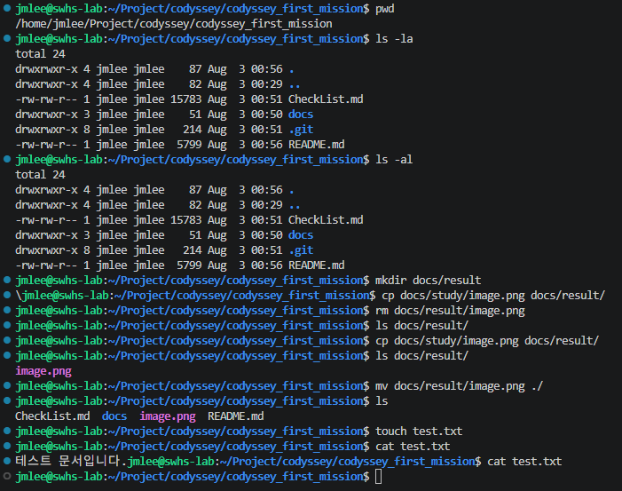
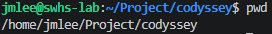
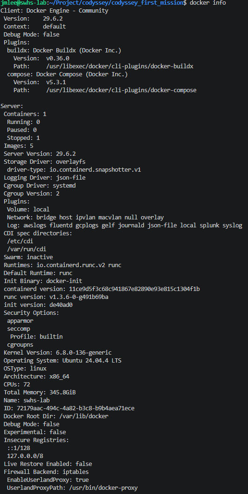
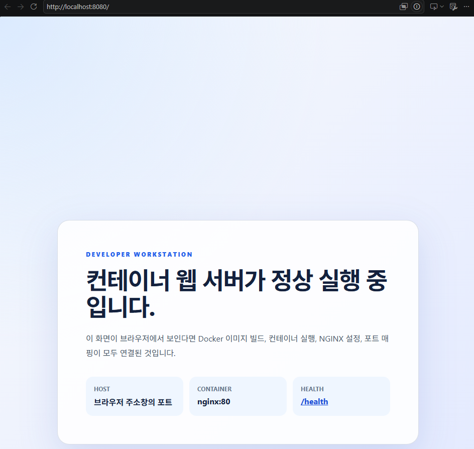
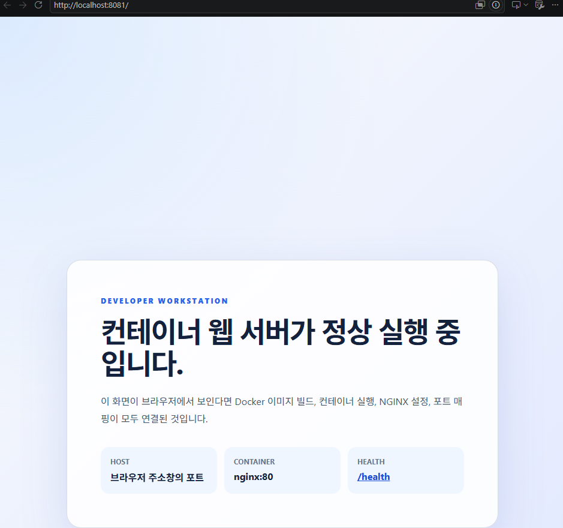
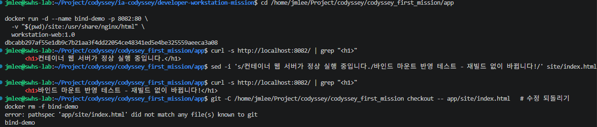
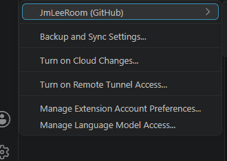
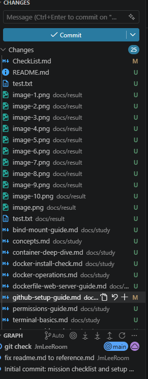

# 개발자 워크스테이션 구축 — Linux CLI / Docker / Git·GitHub

> 코드잇 부트캠프 "내 컴퓨터에 개발자용 '작업실' 꾸미기" 미션 제출용 기술 문서입니다.
> 진행 체크리스트 및 힌트는 [`CheckList.md`](./CheckList.md) 참고. 미션 원문은 [`docs/reference.md`](./docs/reference.md) 참고.

## 1. 프로젝트 개요

이 프로젝트는 로컬 컴퓨터에 재현 가능한 개발 환경을 직접 구축하는 것을 목표로 한다. 핵심 도구는 **리눅스 CLI(터미널)**, **Docker(컨테이너)**, **Git/GitHub(버전 관리 및 협업)** 세 가지이며, 다음 흐름으로 진행한다.

1. 터미널로 작업 디렉토리를 구성하고 파일 권한을 다뤄본다.
2. Docker를 설치·점검하고, 이미지/컨테이너를 실행·관리하는 기본 운영 명령을 익힌다.
3. 기존 Dockerfile을 기반으로 간단한 웹 서버를 컨테이너화하고, 포트 매핑으로 접속을 검증한다.
4. 바인드 마운트와 Docker 볼륨을 각각 사용해 "변경 사항 반영"과 "컨테이너 삭제 후에도 유지되는 데이터 영속성"을 직접 확인한다.
5. Git 사용자 설정과 GitHub/VSCode 연동을 완료해, 모든 작업 결과를 이 저장소에 커밋·푸시한다.

단순히 명령을 따라 치는 것이 아니라, 각 단계의 실행 결과(로그·접속 화면·데이터 유지 여부)로 "이미지와 컨테이너의 분리", "격리된 실행 환경", "포트/스토리지 연결 방식" 같은 구조적 원칙을 직접 검증하고 설명 가능한 형태로 정리하는 것이 이 미션의 목표다.

## 2. 실행 환경

> 아래는 실제 작업 머신에서 확인한 값이다. 확인 명령은 [검증 방법](#4-검증-방법) 절 참고.

| 항목 | 값 |
| --- | --- |
| OS | Ubuntu 24.04.4 LTS (Noble Numbat) |
| Kernel | 6.8.0-136-generic |
| Shell | bash 5.2.21 |
| Docker | 29.6.2 (Docker Engine - Community) |
| Git | 2.43.0 |

> 서울캠퍼스 등 `sudo` 권한 제약 환경에서 작업하는 경우 Docker 대신 OrbStack을 사용했다면 이 표에 함께 명시한다.

## 3. 수행 항목 체크리스트

상세 진행 체크리스트(힌트 포함)는 [`CheckList.md`](./CheckList.md)에서 관리한다. 제출 시점 기준 요약은 아래와 같다.

- [X] 터미널 기초 조작 (이동/생성/복사/이동·이름변경/삭제/내용 확인)
- [X] 파일·디렉토리 권한 변경 실습 (before/after)
- [X] Docker 설치 및 버전/데몬 점검
- [X] Docker 기본 운영 명령 (이미지/컨테이너/로그/리소스)
- [X] 컨테이너 실행 실습 (`hello-world`, `ubuntu` 진입 — `attach` 직접 관찰만 남음)
- [X] 기존 Dockerfile 기반 커스텀 이미지 제작 + 웹 서버 컨테이너화
- [X] 포트 매핑 접속 증거 (서로 다른 호스트 포트 2회 이상)
- [X] 바인드 마운트 반영 확인
- [X] Docker 볼륨 영속성 검증 (컨테이너 삭제 전/후)
- [X] Git 사용자 설정 + GitHub/VSCode 연동
- [X] 트러블슈팅 2건 이상 기록
- [ ] 민감정보 노출 여부 최종 점검

> 상세 항목은 [`CheckList.md`](./CheckList.md)의 각 섹션(2~14)을 참고. 완료된 항목은 이 표와 `CheckList.md` 양쪽에서 함께 체크한다.

## 4. 검증 방법

각 항목을 어떤 명령/증거로 확인했는지 아래에 정리한다. **명령과 출력 결과를 코드블록으로 함께 기록**하고, 스크린샷은 `docs/study/` 등 하위 경로에 저장한 뒤 링크로 연결한다.

### 4.1 터미널 조작 로그

상세 로그 및 관찰 메모: [`docs/study/terminal-basics.md`](./docs/study/terminal-basics.md)

```bash
$ pwd && ls -la && mkdir docs/result && cp/rm/cp docs/study/image.png docs/result/ && mv ... ./ && touch test.txt && cat test.txt
$ cd sub_dir && pwd   # 디렉토리 이동
$ cd .. && pwd
```




### 4.2 권한 실습 (before/after)

상세 로그 및 관찰 메모: [`docs/study/permissions-guide.md`](./docs/study/permissions-guide.md)

```bash
$ touch test.txt && ls -l test.txt        # before: -rw-rw-r--
$ chmod 600 test.txt && ls -l test.txt    # after:  -rw-------
$ ls -ld test                             # before: drwxr-xr-x (755)
$ chmod 700 test && ls -ld test           # after:  drwx------ (700)
```


### 4.3 Docker 설치/점검 로그

상세 로그 및 관찰 메모: [`docs/study/docker-install-check.md`](./docs/study/docker-install-check.md)

```bash
$ docker --version
Docker version 29.6.2, build dfc4efb

$ docker info
# 데몬 정상 응답 확인 (Server: 섹션 포함 전체 출력은 study 문서 참고)
# Containers: 1 (Stopped: 1) / Images: 5 / Cgroup Driver: systemd / Storage Driver: overlayfs
```



### 4.4 Docker 운영 명령 로그

상세 로그 및 관찰 메모: [`docs/study/docker-operations.md`](./docs/study/docker-operations.md)

```bash
$ docker images
# alpine:3.23, alpine:latest, hello-world:latest, ubuntu:latest, workstation-web:1.0 확인

$ docker ps
# 실행 중인 컨테이너 없음

$ docker ps -a
# hello-world 기반 컨테이너 1개 (Exited)

$ docker logs compassionate_gates
# hello-world 안내 메시지 전체 출력 확인 (전체 로그는 study 문서 참고)

$ docker run -d --name stats-demo ubuntu sleep infinity
$ docker stats --no-stream
# stats-demo 컨테이너 CPU/MEM/NET/BLOCK IO 수치 확인 (전체 출력은 study 문서 참고)

$ docker pull alpine:latest
# Status: Image is up to date for alpine:latest

$ docker stop stats-demo
# STATUS가 Up -> Exited (137)로 전환 확인
```

### 4.5 컨테이너 실행 심화 (`exec` vs `attach`)

상세 로그 및 구조 설명: [`docs/study/container-deep-dive.md`](./docs/study/container-deep-dive.md)

```bash
$ docker exec stats-demo ls -la /
$ docker exec stats-demo echo "Hello from Inside Ubuntu Container!"
$ docker exec stats-demo bash -c "echo executing subshell; exit"
$ docker ps --filter name=stats-demo   # exec 종료 후에도 Up 상태 유지 확인
```

- `hello-world` 실행 결과: `docker logs compassionate_gates`로 확인 (4.4 참고)
- `attach`로 PID 1 종료를 직접 관찰하는 실습은 TTY가 필요해 아직 진행 전 — 절차는 study 문서에 정리해둠

### 4.6 Dockerfile 기반 웹 서버 컨테이너

완료 기록(빌드/실행/curl 전체 로그): [`docs/study/dockerfile-web-server-guide.md`](./docs/study/dockerfile-web-server-guide.md)

- 선택한 베이스: `nginx:1.30-alpine`
- 커스텀 포인트: NGINX 설정 교체(`/health` 엔드포인트, 커스텀 헤더), 정적 콘텐츠 교체, `HEALTHCHECK` 추가, `EXPOSE 80`, `LABEL` 메타데이터 (5가지, 상세는 study 문서 표 참고)
- Dockerfile 경로: `app/Dockerfile`

```bash
$ cd app && docker build -t workstation-web:1.0 .
# ... naming to docker.io/library/workstation-web:1.0 done

$ docker run -d --name web-demo -p 8080:80 workstation-web:1.0
$ docker run -d --name web-demo-2 -p 8081:80 workstation-web:1.0
```

### 4.7 포트 매핑 접속 증거

```bash
$ curl -i http://localhost:8080/   # HTTP/1.1 200 OK, X-Workstation-Lab: ready
$ curl -i http://localhost:8081/   # HTTP/1.1 200 OK, X-Workstation-Lab: ready
```

- 접속 1 (호스트 포트 8080): curl 200 OK + 브라우저 접속 확인 완료
- 접속 2 (호스트 포트 8081): curl 200 OK + 브라우저 접속 확인 완료




같은 이미지(`workstation-web:1.0`)를 서로 다른 호스트 포트로 동시에 띄워도 각각 독립적으로 접속된다는 것이 주소창(포트 포함) + 페이지 내용으로 확인된다.

### 4.8 바인드 마운트 / 볼륨 영속성 증거

- 바인드 마운트: 완료 기록 [`docs/study/bind-mount-guide.md`](./docs/study/bind-mount-guide.md)
- 볼륨 영속성: 완료 기록 [`docs/study/volume-guide.md`](./docs/study/volume-guide.md)

```bash
# 바인드 마운트: 호스트 파일 수정이 재빌드 없이 즉시 반영됨을 확인
$ docker run -d --name bind-demo -p 8082:80 -v "$(pwd)/site:/usr/share/nginx/html" workstation-web:1.0
$ curl -s http://localhost:8082/ | grep "<h1>"     # BEFORE: 원본 문구
$ sed -i 's/.../바인드 마운트 반영 테스트 - 재빌드 없이 바뀝니다!/' site/index.html
$ curl -s http://localhost:8082/ | grep "<h1>"     # AFTER: 즉시 반영된 문구 확인

# 볼륨: 컨테이너 삭제 전/후 동일 체크섬 확인 완료 (5a83c5d4...4cc)
$ docker volume create devlab-data-test
$ docker run -d --name vol-container-1 -v devlab-data-test:/app/data alpine sh -c "..."
$ docker rm -f vol-container-1
$ docker run --rm -v devlab-data-test:/app/data alpine sha256sum /app/data/test.txt
# 삭제 전과 동일한 체크섬 확인 → 영속성 증명
```



### 4.9 Git / GitHub / VSCode 연동 증거

```bash
$ git config --list
core.repositoryformatversion=0
core.filemode=true
core.bare=false
core.logallrefupdates=true
user.name=JmLeeRoom
user.email=[MASKED]@gmail.com
remote.origin.url=https://github.com/JmLeeRoom/codyssey_first_mission.git
remote.origin.fetch=+refs/heads/*:refs/remotes/origin/*
branch.main.remote=origin
branch.main.merge=refs/heads/main

$ git remote -v
origin  https://github.com/JmLeeRoom/codyssey_first_mission.git (fetch)
origin  https://github.com/JmLeeRoom/codyssey_first_mission.git (push)
```

- Git 사용자 설정, 원격 연결, push까지 완료 (연동 절차: [`docs/study/github-setup-guide.md`](./docs/study/github-setup-guide.md))
- VSCode GitHub 로그인/연동 스크린샷: 완료




- 참고: 전역(`--global`) git 설정은 이 머신에 없고, 이 저장소 로컬(`.git/config`) 설정만 되어 있음 — 이 저장소 커밋에는 문제없지만, 다른 저장소에서도 같은 사용자 정보를 쓰려면 `git config --global`로 한 번 더 설정 필요

## 5. 트러블슈팅

> 문제 → 원인 가설 → 확인 → 해결/대안 순. Docker 설치 과정에서 이 머신에 실제로 발생했던 이슈 2건을 기록한다.

### 사례 1 — 일반 계정에서 `docker.sock` 접근 권한 거부

- **문제**: 데몬은 살아 있는데 CLI가 서버에 붙지 못함.

  ```bash
  $ docker info
  permission denied while trying to connect to the docker API at unix:///var/run/docker.sock
  ```

- **원인 가설**: `dockerd`는 정상 동작 중(`systemctl is-active docker` → `active`)이지만, Docker API 소켓 `/var/run/docker.sock`의 소유 그룹이 `docker`이고 현재 계정이 그 그룹에 속하지 않아 접근이 거부된 것으로 추정 — 설치 문제가 아니라 권한 문제.
- **확인**:

  ```bash
  $ systemctl is-active docker
  active                          # 데몬은 정상 → 설치 문제가 아님
  $ ls -l /var/run/docker.sock
  srw-rw---- 1 root docker 0 ... /var/run/docker.sock
  $ groups
  jmlee sudo users                # docker 그룹이 없음 → 원인 확정
  ```

  `sudo docker info`는 성공했다는 점도 권한 문제라는 가설을 뒷받침했다.
- **해결/대안**: 계정을 `docker` 그룹에 추가.

  ```bash
  $ sudo usermod -aG docker $USER
  $ getent group docker
  docker:x:986:jmlee              # 그룹 반영 확인
  ```

  단, 그룹 변경은 기존 셸 세션에 즉시 반영되지 않는다. 재로그인하거나 `newgrp docker`로 새 그룹 셸을 시작해야 한다.

### 사례 2 — `containerd.io` 설치 시 의존성 충돌 (`held` 패키지)

- **문제**: Docker 공식 패키지 설치가 의존성 충돌로 중단됨.

  ```bash
  $ sudo apt-get install -y docker-ce docker-ce-cli containerd.io docker-buildx-plugin docker-compose-plugin
  The following packages have unmet dependencies:
   containerd.io : Conflicts: containerd
  E: Unable to correct problems, you have held broken packages.
  ```

- **원인 가설**: Ubuntu 기본 저장소의 `containerd`가 이미 설치되어 있고 apt에서 **hold(고정)** 상태로 잠겨 있어, 공식 저장소의 `containerd.io`로 교체할 수 없는 상황으로 추정.
- **확인**: 제거를 시도하자 `-y`만으로는 거부됨(`Held packages were changed and -y was used without --allow-change-held-packages`) — hold가 걸려 있음이 재확인됨.
- **해결/대안**: 근본 원인인 hold 상태를 직접 해제.

  ```bash
  $ sudo apt-mark unhold containerd containerd.io docker-ce docker-ce-cli
  $ sudo apt-get install -y docker-ce docker-ce-cli containerd.io docker-buildx-plugin docker-compose-plugin
  # 기존 containerd/runc가 제거되고 containerd.io가 정상 설치됨
  ```

  `--allow-change-held-packages`로 매번 우회하는 것은 임시방편이라 판단해, hold 자체를 해제하는 방식을 선택했다.

## 6. 참고 문서

- 진행 체크리스트: [`CheckList.md`](./CheckList.md)
- 미션 원문: [`docs/reference.md`](./docs/reference.md)
- 학습 목표 개념 정리: [`docs/study/concepts.md`](./docs/study/concepts.md)
- 터미널 기초: [`docs/study/terminal-basics.md`](./docs/study/terminal-basics.md)
- 권한 실습: [`docs/study/permissions-guide.md`](./docs/study/permissions-guide.md)
- Docker 설치/점검: [`docs/study/docker-install-check.md`](./docs/study/docker-install-check.md)
- Docker 운영 명령: [`docs/study/docker-operations.md`](./docs/study/docker-operations.md)
- 컨테이너 심화(`exec`/`attach`): [`docs/study/container-deep-dive.md`](./docs/study/container-deep-dive.md)
- Dockerfile/웹 서버/포트 매핑: [`docs/study/dockerfile-web-server-guide.md`](./docs/study/dockerfile-web-server-guide.md)
- 바인드 마운트: [`docs/study/bind-mount-guide.md`](./docs/study/bind-mount-guide.md)
- 볼륨 영속성: [`docs/study/volume-guide.md`](./docs/study/volume-guide.md)
- GitHub 연동 절차: [`docs/study/github-setup-guide.md`](./docs/study/github-setup-guide.md)
