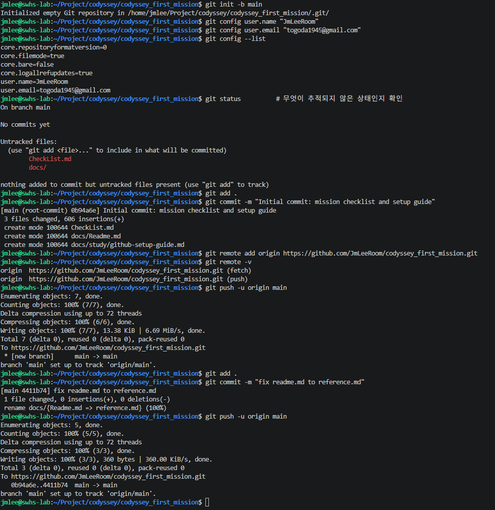

# GitHub 저장소 연동 가이드 (로컬 ↔ 원격 저장소 연결) — 완료 기록

> 대상 저장소: `https://github.com/JmLeeRoom/codyssey_first_mission.git`
> 대응 체크리스트: [`CheckList.md`](../../CheckList.md) 섹션 10 "Git 설정 및 GitHub/VSCode 연동" / [`README.md`](../../README.md) 4.9
> 아래 절차대로 초기화 → 원격 연결 → push까지 완료됐고, VSCode 연동 증거도 확보됐다.

## 0. 사전 확인 — GitHub 저장소를 "빈 저장소"로 만들었는가?

터미널에서 진행할 명령이 갈립니다. GitHub에서 저장소 생성 시 **README/.gitignore/License 중 하나라도 자동 생성 체크를 켰다면** 원격에 이미 커밋이 1개 있는 상태입니다. 아래 두 갈래 중 본인 상황에 맞는 쪽(1-A 또는 1-B)을 따라가세요. 모르겠으면 GitHub 저장소 페이지를 열어 파일이 하나라도 보이는지 확인하면 됩니다 (아무것도 없으면 완전히 빈 저장소).

---

## 1. 터미널에서 로컬 저장소 초기화 + 사용자 설정

```bash
cd /home/jmlee/Project/codyssey/codyssey_first_mission

# 이 폴더를 Git 저장소로 초기화하면서 기본 브랜치명을 main으로 지정
git init -b main

# 이 저장소에만 적용할 사용자 정보 설정 (전역으로 이미 쓰는 이름/이메일이 있다면 --global 로 한 번만 설정해도 됩니다)
git config user.name "본인 이름 또는 GitHub 아이디"
git config user.email "GitHub 가입 이메일"

# 설정 확인
git config --list
```

- `git init -b main` 대신 이미 `git init`을 먼저 했다면 `git branch -M main`으로 브랜치 이름만 바꿀 수 있습니다.
- `git config --list` 결과를 캡처해두면 체크리스트 "Git 설정" 증거로 그대로 쓸 수 있습니다. (이메일이 민감정보라 판단되면 캡처 시 가려도 됩니다.)

## 2. 첫 커밋 만들기

```bash
git status          # 무엇이 추적되지 않은 상태인지 확인
git add README.md docs
git commit -m "Initial commit: mission checklist and setup guide"
```

- `git add .` 로 전체를 한 번에 올려도 되지만, 아직 만든 파일이 `README.md`와 `docs/`뿐이라면 위처럼 명시적으로 지정하는 편이 실수를 줄입니다.

## 3. 원격 저장소 연결

```bash
git remote add origin https://github.com/JmLeeRoom/codyssey_first_mission.git

# 등록됐는지 확인
git remote -v
```

## 4-A. GitHub 저장소가 완전히 빈 상태인 경우

```bash
git push -u origin main
```

- `-u`(`--set-upstream`)를 붙이면 이후부터는 `git push`만 입력해도 됩니다.
- 처음 push 시 브라우저 창이 뜨며 GitHub 로그인을 요구할 수 있습니다(Git Credential Manager가 설치돼 있는 경우). 로그인하면 자동으로 인증이 저장됩니다.
- 브라우저 인증이 뜨지 않고 터미널에 `Username`/`Password`를 물으면, 비밀번호 자리에는 GitHub 계정 비밀번호가 아니라 **Personal Access Token(PAT)** 을 입력해야 합니다. GitHub → Settings → Developer settings → Personal access tokens에서 발급합니다. (토큰 값은 스크린샷/로그에 남기지 마세요.)

## 4-B. GitHub 저장소에 이미 커밋(README 등)이 있는 경우

로컬과 원격의 히스토리가 서로 다르므로 바로 push하면 거부됩니다. 원격 내용을 먼저 받아와 합친 뒤 올립니다.

```bash
git pull origin main --allow-unrelated-histories
```

- 이 명령을 실행하면 병합 커밋 메시지를 입력하는 편집기가 열릴 수 있습니다. 그대로 저장하고 닫으면 됩니다(대부분 편집기는 `:wq` 또는 `Ctrl+O`→`Ctrl+X` 등, 열린 편집기에 따라 다릅니다).
- 만약 `README.md`처럼 로컬과 원격에 동시에 존재하는 파일이 충돌하면, 충돌 표시(`<<<<<<<`, `=======`, `>>>>>>>`)가 파일에 남습니다. 직접 열어서 원하는 내용만 남기고 표시를 지운 뒤:

```bash
git add README.md
git commit
```

그 다음 push합니다.

```bash
git push -u origin main
```

## 5. 결과 검증

```bash
git remote -v        # origin 주소가 정확한지 재확인
git log --oneline    # 커밋이 반영됐는지 확인
git status            # "Your branch is up to date with 'origin/main'" 확인
```

- GitHub 저장소 페이지(`https://github.com/JmLeeRoom/codyssey_first_mission`)를 새로고침해서 `README.md`와 `docs/`가 보이는지 확인하세요.

---

## (대안) VSCode GUI로 연결하기

터미널 대신 VSCode에서 처리하고 싶다면:

1. VSCode에서 이 프로젝트 폴더 열기
2. 좌측 Source Control 패널 → "Initialize Repository" 클릭 (아직 초기화 전이라면)
3. 변경 파일 스테이징(`+` 아이콘) → 커밋 메시지 입력 → 커밋
4. Source Control 패널 상단 "Publish Branch" 클릭 → GitHub 로그인 안내가 뜨면 로그인
5. "Publish"를 누르면 새 저장소를 만들지 물어보는데, **이미 만든 저장소가 있으므로** 이 흐름 대신 터미널에서 위 3번(`git remote add origin ...`)까지만 먼저 실행해두고, 이후 VSCode 하단 상태 표시줄의 동기화(↑↓) 아이콘을 눌러 push/pull하는 방식을 추천합니다.

---

## 완료 후 기술 문서에 남길 증거

- [x] `git config --list` 출력 (사용자 설정 증거)

```bash
$ git config --list
core.repositoryformatversion=0
core.filemode=true
core.bare=false
core.logallrefupdates=true
user.name=JmLeeRoom
user.email=[MASKED]@gmail.com
remote.origin.url=https://github.com/JmLeeRoom/codyssey_first_mission.git
remote.origin.fetch=+refs/heads/*:refs/remotes/origin/*
branch.main.remote=origin
branch.main.merge=refs/heads/main
```

- [x] `git remote -v` 출력 (원격 연결 증거)

```bash
$ git remote -v
origin  https://github.com/JmLeeRoom/codyssey_first_mission.git (fetch)
origin  https://github.com/JmLeeRoom/codyssey_first_mission.git (push)
```

- [x] `git push` 성공 로그 (최초 push + 이후 추가 push)

```bash
# 최초 초기화 ~ push (docs/result/image.png)
$ git init -b main
$ git config user.name "JmLeeRoom"
$ git config user.email "togoda1945@gmail.com"
$ git add . && git commit -m "Initial commit: mission checklist and setup guide"
$ git remote add origin https://github.com/JmLeeRoom/codyssey_first_mission.git
$ git push -u origin main
 * [new branch]      main -> main

# 이후 app/ 추가 후 push
$ git add .
$ git commit -m "git check"
[main 751469a] git check
 6 files changed, 180 insertions(+)
 create mode 100644 app/.dockerignore
 create mode 100644 app/Dockerfile
 create mode 100644 app/compose.yaml
 create mode 100644 app/nginx/default.conf
 create mode 100644 app/site/index.html
 create mode 100644 app/site/styles.css
$ git push origin main
To https://github.com/JmLeeRoom/codyssey_first_mission.git
   4411b74..751469a  main -> main
```



- [x] VSCode에서 GitHub 로그인 완료

VSCode 계정 메뉴에 `JmLeeRoom (GitHub)` 계정이 로그인된 상태로 표시된다.


- [x] VSCode에서 저장소 연동 완료 + 증거(스크린샷) 첨부

Source Control 패널에 이 저장소의 변경 사항(25개 변경)과 커밋 그래프(`git check`, `fix readme.md to reference.md`, `Initial commit...`)가 `main` 브랜치 기준으로 표시되고, 하단 동기화 아이콘으로 원격과 연결돼 있음이 확인된다.

