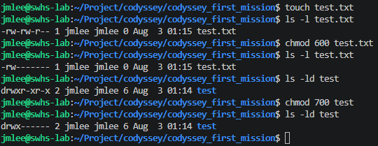

# 파일/디렉토리 권한 실습 명령어

> 대응 체크리스트: [`CheckList.md`](../../CheckList.md) 섹션 3 "파일 권한 실습" / [`README.md`](../../README.md) 4.2

## 1. 현재 권한 확인

```bash
$ ls -l 대상파일
$ ls -ld 대상디렉토리   # 디렉토리는 -d를 붙여야 디렉토리 자체 정보가 나옴 (안 붙이면 내부 목록이 나옴)
```

출력 앞부분 `-rw-r--r--` / `drwxr-xr-x` 형태를 읽는 법: 맨 앞 1글자는 파일(`-`)/디렉토리(`d`) 구분, 이후 3글자씩 소유자(owner) / 그룹(group) / 기타(others) 권한(r/w/x)이다.

## 2. 숫자(8진수) 표기로 변경 — `chmod`

```bash
$ chmod 644 대상파일       # 소유자 rw-, 그룹 r--, 기타 r--
$ chmod 755 대상디렉토리    # 소유자 rwx, 그룹 r-x, 기타 r-x
```

r=4, w=2, x=1을 더한 값이 각 자리 숫자가 된다 (예: rwx=7, r-x=5, rw-=6, r--=4).

## 3. 기호(symbolic) 표기로 변경 — `chmod`

숫자 표기 대신, 대상(`u`=소유자/`g`=그룹/`o`=기타/`a`=전체)과 연산(`+`추가/`-`제거/`=`지정)을 조합해서도 바꿀 수 있다.

```bash
$ chmod u+x 대상파일     # 소유자에게 실행 권한 추가
$ chmod go-w 대상파일    # 그룹과 기타에서 쓰기 권한 제거
$ chmod a+r 대상파일     # 모두에게 읽기 권한 추가
```

## 4. 소유자/그룹 변경 — `chown` / `chgrp`

```bash
$ chown 사용자명 대상파일
$ chown 사용자명:그룹명 대상파일
$ chgrp 그룹명 대상파일
```

- 본인이 소유하지 않은 파일의 소유자를 바꾸려면 보통 `sudo`가 필요하다. 서울캠퍼스처럼 `sudo`가 제한된 환경이면 본인 소유 파일 범위 내에서만 실습한다.

## 5. 실습 흐름 예시 (파일 1개 + 디렉토리 1개)

```bash
# --- 파일 ---
$ ls -l test.txt                # before
$ chmod 600 test.txt            # 변경
$ ls -l test.txt                # after

# --- 디렉토리 ---
$ mkdir perm-test
$ ls -ld perm-test              # before
$ chmod 700 perm-test           # 변경
$ ls -ld perm-test              # after
```
## 6. 실제 실습 결과

```bash
# --- 파일: test.txt (644 -> 600) ---
$ touch test.txt
$ ls -l test.txt
-rw-rw-r-- 1 jmlee jmlee 0 Aug  3 01:15 test.txt

$ chmod 600 test.txt
$ ls -l test.txt
-rw------- 1 jmlee jmlee 0 Aug  3 01:15 test.txt

# --- 디렉토리: test (755 -> 700) ---
$ ls -ld test
drwxr-xr-x 2 jmlee jmlee 6 Aug  3 01:14 test

$ chmod 700 test
$ ls -ld test
drwx------ 2 jmlee jmlee 6 Aug  3 01:14 test
```



**숫자 ↔ r/w/x 대응 정리**

| 대상 | 변경 전 | 변경 후 | 의미 |
| --- | --- | --- | --- |
| 파일 `test.txt` | `rw-rw-r--` (664)\* | `rw-------` (600) | 그룹·기타 사용자의 읽기 권한까지 모두 제거 → 소유자 전용 |
| 디렉토리 `test` | `rwxr-xr-x` (755) | `rwx------` (700) | 그룹·기타 사용자의 조회(`r`)·진입(`x`) 권한 차단 |

\* `touch`로 만든 파일은 시스템 umask에 따라 기본 664가 되기도 한다(가이드 예시의 644와 조금 다름 — 실습 환경의 umask 차이일 뿐 정상이다).

파일과 디렉토리에서 `x`의 의미가 다르다: 파일의 `x`는 "실행 가능", 디렉토리의 `x`는 "그 안으로 `cd`해서 들어갈 수 있음"이다. `test` 디렉토리를 700으로 바꾸면 소유자 본인 외에는 `cd`도 `ls`도 할 수 없게 된다.

before/after 출력을 그대로 캡처해서 `README.md` 4.2에 붙여넣고, 숫자와 r/w/x가 어떻게 대응하는지 한 줄 설명을 추가하면 CheckList 섹션 3의 "숫자 표기 ↔ r/w/x 대응 규칙 설명" 항목도 함께 채워진다.
